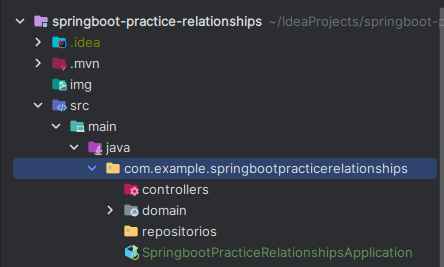
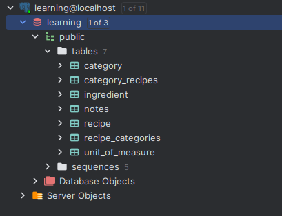
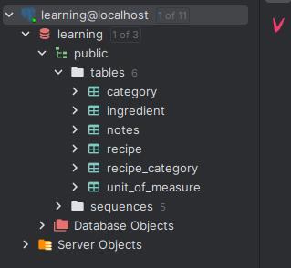

## Tips:
### 1 - How to load data.sql using hibernate-ddl
We need to add `spring.jpa.defer-datasource-initialization: true`  and `spring.sql.init:mode`, 
to load `data.sql` The database initialization happens on the embedded in-memory database by default, 
though we can set the `spring.sql.init` mode to `always` initialize the SQL database. It also enables the 
fail-fast feature by default for the script-based database initializer, i.e. the application cannot start 
if the scripts throw exceptions.

`application.yml` file:
```yml
spring:
  datasource:
    url: jdbc:postgresql://localhost:5432/learning
    username: postgres
    password: password
  jpa:
    hibernate:
#     This can be a create or create-drop
      ddl-auto: create
    show-sql: true
#    This will insure data.sql to perform
    defer-datasource-initialization: true
# Ensures that data.sql will load
  sql:
    init:
      mode: always
```

`application.properties` file:
```properties
spring.datasource.url=jdbc:postgresql://localhost:5432/learning
spring.datasource.username=postgres
spring.datasource.password=password
# This can be a create or create-drop
spring.jpa.hibernate.ddl-auto=create
spring.jpa.show-sql=true
# This will insure data.sql to perform
spring.jpa.defer-datasource-initialization=true
# Ensures that data.sql will load
spring.sql.init.mode=always

```
### 2 - Create the POJOs inside the package


Otherwise Springboot won't create the entities as tables in the db.

### 3 - Create a join table to create 2FN (Second normal form of normalization)
Here Springboot creates 2 tables that have the same purpose (`recipe_categories` & `category_recipes`):



To avoid that it's important to a `@JoinTable`:
```java 
    //Recipe.java
    @ManyToMany
    @JoinTable(name = "recipe_category",
    joinColumns = @JoinColumn(name = "recipe_id"),
    inverseJoinColumns = @JoinColumn(name = "category_id"))
    private Set<Category> categories;
```
```java
    //Category.java
    @ManyToMany(mappedBy = "categories")
    //mappedBy = "categories" means that will use 
    //private Set<Category> categories from Recipe.java
    private Set<Recipe> recipes;
```
Now it'll create a normal table instead of two:



